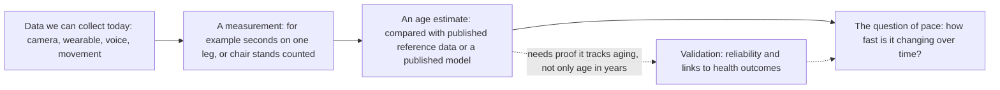
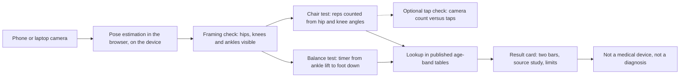

# Sundai Hack 143, explained: Biomarkers of Aging

**Live site:** https://wilsonwu-ai.github.io/sundai-hack-143/ (the demo ships there during the hack, 4 Oct 2026)

A STAR write-up of Sundai Hack 143 at the Harvard Innovation Lab: the **Situation** (what the hack asked, and what a biomarker of aging is), the **Task and Action** (every candidate approach, and why we chose ours), and the **Result** (what we built and deployed).

Every number in this repo cites a finding ID like [F21]. Findings live in `research/verified.json` with their source URL, publication date and how they were checked.

## ELI5: the whole hack in one paragraph

Think of a used car. The odometer tells you how many miles it has driven, and that is like your age in years. But two cars with the same mileage can be in very different shape, and one can be wearing out faster than the other. Scientists look for "biomarkers of aging", which are measurements that act like a mechanic's checks: they try to tell how worn the engine really is, and how fast it is wearing, not just what the odometer says. Sundai Hack 143 asked teams to build, in one day, a small web app that does this kind of check using things we can collect today, like a phone camera [F51] [F52]. We chose to have the camera watch a person do a one-leg stand and a few chair stands, then compare the result with tables that researchers published for people of different ages, the way a test drive is compared with a table of results from many cars of each age. The app shows where the result falls and which study the table came from. It does not tell anyone their health, and it is not a medical device.

## The big picture

The field moves in four steps, and our app only covers the first three, in a small way. The last step, pace, needs repeated measurements over time, which a one-day demo cannot give [F41].

The dotted path matters most. A model that only guesses age in years is not enough. The field asks whether a measure is reliable when repeated and whether it is linked to outcomes such as illness and death [F42] [F46].

## Map of this repo

| Path | What it is |
|---|---|
| `index.html` and `src/` | The demo: the web app a voter opens on a phone or laptop. |
| `public/explainer/` | The picture explainer: a visual walk through the same story. |
| `research/` | The evidence trail: `findings.json` (what the research agents found), `quotecheck.json` (a script checking each quote against its source), `verified.json` (the findings that survived review, which every `[F##]` citation points to) and `synthesis.json` (scored ideas, the pick and the pitch). |
| `scripts/` | The tooling: `quotecheck.py`, `resolve-sources.py`, `merge-verified.py`, `render-sources.py`, `build-readme.mjs` (builds this README from `docs/star/`) and `wrap-explainer.mjs`. |
| `tests/` | `unit/` for fast logic and docs checks, `e2e/` for browser tests. |
| `.github/workflows/ci.yml` | CI/CD: tests on every push, deploy to GitHub Pages only from `main` after the tests pass, then a smoke test on the live URL. |

## S: Situation

### Sundai Club and Hack 143

Sundai Club describes itself as the largest MIT / Harvard AI hacker group, one that meets every Sunday to build a new AI app from scratch by the end of the day [F51]. Hack 143 is the Biomarkers of Aging hack. It ran on Sunday 4 October 2026, from 10:00 to 22:00 at Harvard [F51]. It is part of Boston Longevity Week (1 to 7 October 2026), organized by Sundai Club, and the 2026 Biomarkers of Aging Conference follows on 5 and 6 October at Harvard Medical School [F52]. The Boston Longevity Hub describes the hack as "a one-day AI hackathon to build and test aging biomarkers from imaging, wearables, and physiological signals" [F52].

The question, as the organizers' brief we worked from puts it: how can we measure how fast someone is aging, using data we can collect today, such as a face photo, a phone camera, a wearable, voice or a simple movement test? The exact wording comes from our notes of the brief. The event pages [F51] [F52] confirm the theme and the kinds of data.

The schedule has three fixed points: a 10:30 Biomarkers of Aging overview, 11:00 team formation, and 20:00 final presentations. No co-host or named speaker is listed for the overview [F51].

### How the vote and the rules work

This part is thinner than we would like. The pages we could read did not confirm Sundai's judging and voting rules, team-size rule or open-source requirement. Our only source is the organizers' brief as recorded in our notes, so treat these as unconfirmed by any finding:

- Presentations happen at 20:00 and the audience votes on what it saw.
- Teams are of at least two people.
- The app must be on a public URL.
- The code must be open source.

We designed for all four anyway, because they cost us little: two people, a public GitHub Pages site and an open repo.

### What decides the vote

Our read of what wins, drawn from the research (see `research/synthesis.json`):

- Voters can try it on themselves in the room, straight after the presentations. A demo they run on their own phone is remembered. A slide is not.
- Scientific honesty. The audience includes researchers and clinicians who know the literature. The Biomarkers of Aging Consortium says the field lacks standards and consensus on what makes a reliable aging biomarker [F46], and its conference starts the next day [F52].
- A link to aging outcomes, not only to guessing age in years. For example, the open voice age model we looked at has an error between 7.1 and 10.8 years and predicts chronological age only [F34].
- A working app on a public URL. A broken demo is out of the running.
- Visible AI that is not a copy. FaceAge is the headline example in the organizers' brief and its code is public [F14], so several teams are likely to build selfie age.

### What a biomarker of aging is

Precisely: a biomarker of aging is a measurable signal that changes with the biology of aging and says something about a person's aging beyond the number of birthdays. This is our working definition. The Consortium's own stated goal is "standardized, clinically validated ways to measure aging" [F53], and its Cell paper proposes a framework for terminology and characterization of these markers [F46]. The abstract does not itself list the criteria, and we did not read the full text, so we do not claim to list them.

Biomarkers come in many forms. Some are blood based. DNAm PhenoAge is an epigenetic clock, a DNA-methylation measure trained on a clinical phenotypic age, and it predicts all-cause mortality, cancers, healthspan, physical functioning and Alzheimer's disease [F43]. Organ-specific plasma-proteomic ages were built for 11 organs in 5,676 adults across five cohorts [F44]. Some are image based. FaceAge reads a face photo with a deep-learning system, and cancer patients looked about 4.79 years older than a non-cancerous reference cohort [F11].

An analogy: think of a car again. The odometer is age in years. A biomarker is the mechanic's reading of the engine: compression, oil quality, wear. Two cars with the same mileage can read very differently.

### Biological age versus pace of aging

Chronological age is the count of years since birth. Biological age is a measure of where a person's body stands on a scale of wear. Many models only predict chronological age. The voice model above is one of them, so it is a weak aging proxy [F34].

Pace of aging is different again. It is a rate, not a level. DunedinPACE was modelled by tracking within-individual decline in 19 indicators of organ-system integrity across four time points spanning two decades, then distilled into a one-time DNA-methylation blood test [F41]. In the car analogy, biological age is the engine's condition today, and pace is how quickly that condition is changing. A single one-day measurement can hint at a level. A rate needs repeats.

The idea of one number is also under pressure. In the proteomic work, nearly 20% of the population show strongly accelerated age in one organ and 1.7% are multi-organ agers, which supports a per-organ profile rather than a single age number [F45].

### What scientists require of a valid biomarker

The validation template we kept coming back to is DunedinPACE: high test-retest reliability (you get about the same answer when you measure again), plus association with morbidity, disability and mortality [F42]. Accelerated organ aging in the proteomic study carries 20 to 50% higher mortality risk [F44]. The Consortium says the lack of standards and consensus on the properties of a reliable aging biomarker hinders further development and validation for clinical applications [F46].

The Consortium also runs the Biomarkers of Aging Challenge. Phase I used DNA methylation data from 500 individuals aged 18 to 99, which is blood based and not camera based. Its phases are chronological age, mortality and multi-morbidity [F54].

What this means for a camera app is simple, and it shaped every choice later: report error honestly, show the source of every number, and never present a result as proof of health. This app estimates an age band from published reference data. It is not a medical device and it does not diagnose anything.

## T and A: Task and Action

### Task

We set out to build and publish, within one Sunday, a working web app that speaks to the hack's question: how fast is someone aging, using data we can collect today. The app had to be live on a public URL by the 20:00 presentations [F51].

Our constraints:

- One day, with team formation at 11:00 and presentations at 20:00 [F51]. Anything that needed training a model or a server was out.
- A voter should be able to try it on their own device in about 60 seconds.
- Every number on screen must come from a published source, shown next to the number.
- The app estimates an age band from published reference data or a published model. It must never claim to diagnose, to measure health or to replace a clinician. Not a medical device.
- Open source, public URL, and a team of at least two (these rules are unconfirmed by any finding, see the Situation).
- Do not copy what the crowd is likely to build, and credit prior art openly.

### The candidate approaches

Before choosing, we had research agents survey five lanes (imaging, movement and fitness, wearables and voice, aging-clock science, and the hack itself). Each finding was then checked by script and by reviewers. Where a source did not hold up, we dropped it, and where it held up only in part we mark it "unverified" or state its limits. Below, each approach lists what it reads, how it estimates aging, the evidence, what a one-day build would take and whether a voter could try it in 60 seconds.

#### FaceAge (face photo)

- **Reads:** a face photo.
- **How it estimates aging:** a deep-learning system estimates a biological age from the face. The public code uses MTCNN face localization plus an Inception-ResNet v1 age estimator [F14]. It was developed at Mass General Brigham, led by Hugo Aerts, and trained on 58,851 photos of presumed healthy people from public datasets [F12].
- **Evidence:** cancer patients looked about 4.79 years older than a non-cancerous reference cohort [F11]. In 6,196 cancer patients from two centers, older FaceAge was associated with worse survival, especially in people who looked older than 85 [F13]. This is evidence in cancer patients. It is not validation in healthy adults. The repository states its code and data are not intended for clinical care or commercial use, and no license type was seen on the page [F14]. We could not confirm a current permanent link to the model weights.
- **One-day build:** medium risk at best. Without the original weights we would need a substitute model, and a substitute does not carry FaceAge's evidence. Each team that builds this has the same problem.
- **60 seconds:** yes, a selfie is the fastest demo of all. It is also the most likely to be built by other teams, because it is the first example in the brief.

#### HandAge (hand photo)

- **Reads:** a photo of the back of the hand.
- **How it estimates aging:** the only hand-photo work we found predicted chronological age, not biological age. We state none of its error figures: the one claim we extracted from a news page had its numbers swapped on review, and we removed it.
- **Evidence:** thin. Not established: any HandAge-named model, public code or model weights, or any link between hand photos and illness or death. One point survived: hand images can identify a person, as faces can, which is a privacy risk [F16].
- **One-day build:** not realistic, since no weights were found.
- **60 seconds:** a photo is quick, but we would be showing a number with no evidence behind it.

#### Wearable-based aging biomarkers

- **Reads:** exports from a wrist device, such as resting heart rate, heart-rate variability, sleep and steps.
- **How it estimates aging:** a composite over time. We explored the idea of a pace score from two time windows, borrowing the rate-not-level idea from DunedinPACE [F41].
- **Evidence:** thin for wearables as such. Heart-signal evidence is covered under cardiovascular below. The validation template (reliability plus outcome association) is clear [F42], but we found no evidence that a wearable composite tracks aging.
- **One-day build:** medium to hard. Parsing exports is easy, but a defensible composite is not.
- **60 seconds:** no. A voter would have to export personal health data on stage.

#### Voice

- **Reads:** a short speech recording.
- **How it estimates aging:** the open audeering model, wav2vec2-large-robust-24-ft-age-gender, outputs age on a 0 to 1 scale (0 to 100 years) plus child, female and male probabilities. Its license is CC-BY-NC-SA-4.0 (non-commercial), and an ONNX export is on Zenodo [F33].
- **Evidence:** the paper behind it reports age error between 7.1 and 10.8 years depending on dataset. It predicts chronological age only, not biological age [F34]. We found no evidence tying voice to biological aging or frailty.
- **One-day build:** hard to do on a phone browser. A large model in the browser or a hosted endpoint would be needed.
- **60 seconds:** yes, speaking for ten seconds works. But the output would be a guess of years with a large error, not a biomarker.

#### Movement (balance and chair stands)

- **Reads:** camera video of a person standing on one leg and rising from a chair, with pose estimation in the browser.
- **How it estimates aging:** timing and rep counts are placed on published age-band reference tables.
- **Evidence:**
  - Unipedal stance norms for 549 healthy adults aged 18 and over, with six age bands from 18 to 39 up to 80 and over, for eyes open and closed [F22]. The abstract gives no per-band seconds.
  - Sit-to-stand percentiles by sex and age (5-rep, 30-second and 1-minute tests) in 393 healthy Colombian adults [F23]. The abstract gives no percentile tables.
  - Inability to complete a 10-second one-leg stance was associated with all-cause mortality after adjusting for age, sex, BMI and comorbidities, hazard ratio 1.84 (95% CI 1.23 to 2.78), in 1702 adults aged 51 to 75 [F21] (unverified: the script quote check failed, though reviewers upheld it from the Europe PMC abstract). It must not be applied to people under 51.
  - Remote video sit-to-stand assessment showed good to moderate validity against in-person testing in 38 post-COVID adults, with minimal detectable change values of 6.6 and 10.5 repetitions [F24]. Human raters did that rating, not pose estimation.
  - Thin spots: we found no study validating pose estimation for rep counting or balance timing. We did not retrieve chair height and arm position protocols.
- **One-day build:** realistic. It is a static site with no server and no training. The risk is transcribing reference tables from full texts and getting the camera framing right.
- **60 seconds:** yes, with the whole body in view, so a friend holds the phone or it is propped up.

#### Sleep

- **Reads:** a sleep export or a sleep CSV.
- **How it estimates aging:** a sleep regularity score computed in the browser.
- **Evidence (unverified, and restricted):** in a UK Biobank accelerometer cohort, higher sleep regularity was associated with lower all-cause mortality [F31] (unverified). Regularity was a stronger mortality predictor than duration [F32] (unverified). Review restricted both: the cohort averages 62.8 years and the regularity score came from seven days of wrist accelerometer data. We do not apply those mortality figures to adults aged 20 to 70, and we do not use the numeric range from [F31] here. The score formula and quintile cutoffs were not retrieved.
- **One-day build:** medium. Parsing is simple.
- **60 seconds:** no. It needs health data exported on stage.

#### Cardiovascular signals

- **Reads:** pulse from the phone camera, by fingertip or from the face.
- **How it estimates aging:** a heart rate or a pulse-wave model.
- **Evidence:** in healthy young adults, fingertip camera heart rate matched resting ECG (r=.997, RMSE 1.03 beats per minute). Contact-free face pulse was less accurate than fingertip, especially after exercise [F35]. A deep-learning "PPG age" exists as a preprint from a Peking University group, using 212,231 UK Biobank participants with a check in MIMIC-III (2,343) [F36]. We could not retrieve weights for it. We found no evidence that heart rate from a phone camera tracks aging. A consumer app already estimates body age from fingertip pulse plus an activity questionnaire [F56].
- **One-day build:** medium to hard. Face pulse is fragile in hall lighting.
- **60 seconds:** yes for a fingertip heart rate, but it is a heart rate, not an aging measure.

#### Fitness

- **Reads:** a set of fitness tests (chair stand, grip, walking, step test).
- **How it estimates aging:** a regression equation turns test results into a "fitness age". A Korean cohort of 501,774 people built such equations. The older-adult model uses the 30-second chair stand, grip, 2-minute step, sit-and-reach, timed up and go and sex (adjusted R2 24.3%), and the adult model reached 93.6% [F25]. It is based on supervised fitness-centre data.
- **Evidence:** a Chinese cohort of 2207 adults aged 60 and over derived a physical fitness age from a 5-time chair stand plus grip, walking speed and peak flow. Accelerated aging on that measure had adjusted odds ratios of 1.88 for depressive symptoms and 1.76 for cognitive impairment, in a cross-sectional design [F26]. Grip and peak flow need equipment, which a camera app lacks. This does not apply below 60.
- **One-day build:** only the chair-stand part is camera friendly. We kept the Korean equation as a stretch goal, if its coefficients can be read from the full text.
- **60 seconds:** only the chair stand.

#### Combinations

We looked at four ways to fuse signals:

- A three-signal panel: face-video heart rate, a heart-rate-variability proxy and a voice age estimate. The most vivid AI on stage, and the weakest science. The voice error is [F34] and face pulse is less accurate than fingertip [F35].
- An "arcade" combining face photo, 30-second sit-to-stand and fingertip pulse into one age. No published method in our findings combines these signals into one age, and three captures will not fit in 60 seconds.
- Face estimate beside the movement bands. The movement half carries the evidence [F22] [F23], and the face half would need a licensed model while FaceAge is research-only [F14].
- Movement plus fingertip pulse before and after chair stands, with separate bars. Showing domains separately follows the per-organ argument in proteomic aging [F45], which is an analogy and not evidence for these signals.

Evidence overall: thin. Combination makes for good theatre, but we found nothing that validates a fused age.

### How we scored them

We scored each idea from 0 to 5 on five criteria, with these weights: live demo 25, science 25, differentiation 15, buildability 20, AI and wow 15. Totals below are computed in code from those weights and are out of 100. They are exactly as in `research/synthesis.json`.

| Rank | Idea (ref) | Live demo | Science | Differentiation | Buildability | AI and wow | Total |
|---|---|---|---|---|---|---|---|
| 1 | Movement Age (PRIOR) | 4 | 4 | 3 | 4 | 4 | 77 |
| 2 | Chair-Rise Age, merged with I51 (I21) | 4 | 3 | 2 | 5 | 4 | 73 |
| 3 | Count vs Tap (I22) | 4 | 2 | 4 | 5 | 3 | 71 |
| 4 | Look Age vs Move Age (NEW-1) | 4 | 3 | 3 | 2 | 5 | 67 |
| 5 | AgeGap Selfie Lab (I11) | 5 | 2 | 1 | 3 | 4 | 62 |
| 6 | Age-Gap Evidence Board (I12) | 3 | 3 | 3 | 5 | 1 | 62 |
| 7 | Three-Signal Aging Panel (I32) | 4 | 1 | 3 | 2 | 5 | 57 |
| 8 | Aging Clock Arcade (I52) | 3 | 2 | 3 | 2 | 5 | 57 |
| 9 | Pulse plus Pose (NEW-2) | 3 | 2 | 2 | 3 | 4 | 55 |
| 10 | Clock Report Card (I41) | 1 | 3 | 4 | 3 | 1 | 47 |
| 11 | Regularity Check (I31) | 2 | 2 | 3 | 3 | 1 | 44 |
| 12 | Pace Not Age (I42) | 1 | 2 | 4 | 2 | 2 | 41 |

Three notes on the table. First, the selfie idea has the best live demo and the lowest differentiation, which is the trade we expected. Second, Count vs Tap is a validity check, not an aging measure, so we used it as a feature of the winner rather than a product. Third, Clock Report Card and Pace Not Age score high on differentiation but voters cannot try them on themselves, so they score 1 on live demo.

### Why we chose Movement Age

The pick is Movement Age: prop up your phone, do a one-leg stand and five chair stands, and on-device pose estimation places each result on a published age-band reference table, with the source shown and nothing leaving the device.

Why:

- Every voter can test themselves in the room, and the result rests on published reference values that span adult ages for both tests [F22] [F23].
- It is the only phone-friendly test in our findings with a mortality association after adjusting for age, sex, BMI and comorbidities [F21] (unverified). It is narrow (adults aged 51 to 75), so we show it as context and never as a prediction about the user.
- Remote video assessment of sit-to-stand already showed good to moderate validity against in-person testing [F24]. Adding a live tap check, where a friend taps for each rep and the app shows camera count against tap count, turns that into a visible measured error. That fits the reliability-first template this audience uses [F42] [F46].
- It fits a day's build: a static site, pose estimation on the device, no server and no training [F51].
- It stays out of the crowd most likely to build selfie age, and out of FaceAge's research-only terms [F14]. Hand-age evidence did not survive review.

Honest limits, which we show in the app:

- The age-band numbers are not in the abstracts of [F22] or [F23]. They have to be read from the full texts and transcribed. If we cannot open the full texts, the fallback is to show raw time and reps with the study bands described, and no placement.
- The youngest band in [F22] covers 18 to 39, so we show an age band and never an exact year.
- [F23] is a Colombian sample tested under supervision, [F22] dates from 2007, and chair height may shift results.
- A one-leg stand can cause a fall, so the app tells users to stand next to a wall or chair back.

Kill criteria we set before choosing, and their status as of the synthesis:

| ID | Criterion | Status |
|---|---|---|
| K1 | A published reference table for the chosen tests covers adults from roughly 20 to 80. | Pass on coverage [F22] [F23]. The per-band numbers are not yet in hand. |
| K2 | Evidence that the measure predicts mortality or morbidity beyond chronological age. | Narrow pass: [F21] (unverified), adults aged 51 to 75 only. For chair stands the only outcome link is a composite fitness age in adults aged 60 and over [F26]. Nothing in our findings covers ages 20 to 50. |
| K3 | The 10:30 intro does not hand out data, a model or a prize that favours another modality. | Pending, to be judged live at 10:30 [F51]. |
| K4 | No teammate brings a better idea at 11:00. | Pending, to be judged at team formation. |

How it differs from the existing app. A camera sit-to-stand app already exists: Sit To Stand App on iOS scores the chair-rise test from 240 frames-per-second video and reports time, velocity and muscle power [F55]. Its "scientifically validated" label is the developer's own claim, not independent evidence, and it is Apple-only. We name it as prior art and do not compete with it on biomechanics. What differs: ours runs in any phone or laptop browser with no install, combines a balance test with the chair test, and places each result on published age-band tables, with the source study and cohort shown for each number. The F55 listing does not describe an age-referenced readout. We also differ from the existing phone body-age app that uses fingertip pulse plus a questionnaire [F56]: we show our sources and our measured counting error, not a single body-age score.

### Build plan

Nothing is uploaded. The reference tables ship inside the page, and each bar on the result card names the study and cohort it came from.

CI/CD: every push to the repository runs typecheck, unit tests, a production build and browser tests (Playwright, Chromium). Only the `main` branch deploys to GitHub Pages, and only after those tests pass, so a red test can never reach the live site. After the deploy, a smoke test runs the browser tests against the live URL. Pull requests run the same checks but never deploy. The docs, including this file, are checked in CI too: no em or en dashes, and every `[F##]` citation must point at a finding that survived verification.

## R: Result

In progress. This section is written after the demo ships, with the live URL, what it measures, how it was tested, and what we would do next.

## Glossary

- **Biomarker of aging:** a measurable signal that tracks the biology of aging, not just the number of birthdays; the field is still working out standards for what counts as a reliable one [F46].
- **Chronological age:** years since birth. Some models only predict this, such as the open voice age model [F34].
- **Biological age:** an estimate of how worn a body is, as opposed to how long it has existed; FaceAge is one attempt to read it from a face [F11].
- **Pace of aging:** a rate rather than a level, how fast the body is changing over time; DunedinPACE modelled it from repeated measures [F41].
- **Aging clock:** a model that turns a set of measurements into an age estimate, such as DNAm PhenoAge [F43].
- **DNA methylation:** chemical marks on DNA, read from a blood sample, that DunedinPACE and DNAm PhenoAge are built on [F41] [F43].
- **Test-retest reliability:** whether you get about the same answer when you measure the same person again; part of the validation template [F42].
- **Hazard ratio (HR):** how much more often an outcome happens in one group than another over time; above 1 means more often, and the 10-second one-leg stance result is 1.84 [F21] (unverified).
- **95% confidence interval (CI):** the range of values the data are reasonably consistent with; a wide range means more uncertainty.
- **Mean absolute error (MAE):** the average size of a model's mistakes, in the units of what it predicts, such as years [F34].
- **Pose estimation:** software that finds body joints in video, so an app can see a knee bend or a lifted ankle.
- **Reference table (norms):** published results from a group of people, split by age and sex, used to see where a new result falls [F22] [F23].
- **Unipedal stance test:** standing on one leg for as long as possible, up to a limit; our balance test [F22].
- **Sit-to-stand test:** rising from a chair repeatedly, counted by reps or by time; our leg-strength test [F23].
- **Minimal detectable change:** the smallest change in a score that is bigger than measurement noise; reported as 6.6 and 10.5 repetitions for remote sit-to-stand [F24].

## Sources

Every [F##] in this repo resolves here. **verified**: a script found the quoted text on the cited page. **unverified**: the page blocked the check or the quote did not match exactly, so read the source before relying on it. Findings a reviewer refuted are left out.

| ID | Claim | Source | Date | Check |
|---|---|---|---|---|
| F11 | FaceAge (Bontempi, Zalay, Bitterman and colleagues, Lancet Digital Health 2025, vol 7 no 6) found cancer patients looked about 4.79 years older than a non-cancerous reference cohort. | [cris.maastrichtuniversity.nl](https://cris.maastrichtuniversity.nl/en/publications/faceage-a-deep-learning-system-to-estimate-biological-age-from-fa/) | 2025 | verified |
| F12 | FaceAge was developed at Mass General Brigham, led by Hugo Aerts. It was trained on 58,851 photos of presumed healthy people from public datasets. | [eurekalert.org](https://www.eurekalert.org/news-releases/1082875) | unknown | verified |
| F13 | FaceAge was evaluated in 6,196 cancer patients from two centers. Older FaceAge was associated with worse survival, especially in people who looked older than 85. | [eurekalert.org](https://www.eurekalert.org/news-releases/1082875) | unknown | verified |
| F14 | FaceAge code is public at github.com/AIM-Harvard/FaceAge, with MTCNN face localization plus an Inception-ResNet v1 age estimator. The repo states it is not for clinical or commercial use. No license type was seen on the page. | [github.com](https://github.com/AIM-Harvard/FaceAge) | unknown | verified |
| F16 | Caveats: the hand-age study notes hand images can identify a person, as faces can (privacy risk). FaceAge authors say more research is needed before clinical use. | [biometricupdate.com](https://www.biometricupdate.com/202405/study-finds-dorsal-hand-images-as-effective-as-face-biometrics-for-age-estimation) | 2024 | verified |
| F21 | Araujo 2022 (BJSM): in 1702 adults aged 51-75, inability to complete a 10-second one-legged stance was independently associated with all-cause mortality, adjusted HR 1.84 (95% CI 1.23 to 2.78); 20.4% could not do it; median follow-up 7 years. | [pubmed.ncbi.nlm.nih.gov](https://pubmed.ncbi.nlm.nih.gov/35728834/) | 2022 | unverified |
| F22 | Springer 2007 normative unipedal stance test (eyes open and closed): 549 healthy adults 18+, six age bands, best of 3 trials, performance age-specific and not gender-related; abstract gives no per-band seconds. | [pubmed.ncbi.nlm.nih.gov](https://pubmed.ncbi.nlm.nih.gov/19839175/) | 2007 | verified |
| F23 | Colombian multicenter study (2025) set sex- and age-specific percentile reference values for 5-repetition, 30-second and 1-minute sit-to-stand in 393 healthy adults aged 18 to 80; abstract gives no percentile tables. | [pubmed.ncbi.nlm.nih.gov](https://pubmed.ncbi.nlm.nih.gov/42183074/) | 2025 | verified |
| F24 | Remote video-based sit-to-stand tele-assessment (synchronous and asynchronous) showed good to moderate validity against in-person testing in 38 post-COVID adults; asynchronous reliability between raters was high; minimal detectable change 6.6 and 10.5 reps. | [pubmed.ncbi.nlm.nih.gov](https://pubmed.ncbi.nlm.nih.gov/41328073/) | 2025 | verified |
| F25 | Korea National Fitness Award cohort (BMC Public Health 2024) built regression fitness-age equations from 501,774 people; the older-adult model uses 30-s chair stand, grip, 2-min step, sit-and-reach, TUG and sex (adjusted R2 24.3%); adult model R2 93.6%. | [pubmed.ncbi.nlm.nih.gov](https://pubmed.ncbi.nlm.nih.gov/39334055/) | 2024 | verified |
| F26 | Chinese cohort (2026, n=2207, age 60+) derived a physical fitness age from a 5-time chair stand plus grip, walking speed and peak flow; accelerated aging (PFA minus age over 2.5 y) had aOR 1.88 for depressive symptoms and 1.76 for cognitive impairment. | [pubmed.ncbi.nlm.nih.gov](https://pubmed.ncbi.nlm.nih.gov/42790361/) | 2026 | verified |
| F31 | UK Biobank accelerometer cohort: higher Sleep Regularity Index was associated with 20-48% lower all-cause mortality across the top four quintiles versus the least regular quintile. Cohort of 60,977 participants per the OUP page summary; adjusted for sociodemographic, lifestyle and health factors. | [academic.oup.com](https://academic.oup.com/sleep/article/47/1/zsad253/7280269) | 2024-01 | unverified |
| F32 | Windred 2024: sleep regularity was a stronger predictor of all-cause mortality than sleep duration. Minimally adjusted top-quintile hazard ratio 0.52 for regularity versus 0.69 for duration, per the page summary only; the HR figures were not in the verbatim text I could quote. | [academic.oup.com](https://academic.oup.com/sleep/article/47/1/zsad253/7280269) | 2024-01 | unverified |
| F33 | Open-weights voice age model: audeering wav2vec2-large-robust-24-ft-age-gender on Hugging Face outputs age on a 0 to 1 scale (0-100 years) plus child/female/male probabilities. License is CC-BY-NC-SA-4.0 (non-commercial). ONNX export on Zenodo. Trained on aGender, Common Voice, Timit, Voxceleb 2. | [huggingface.co](https://huggingface.co/audeering/wav2vec2-large-robust-24-ft-age-gender) | unknown | verified |
| F34 | Paper behind the audeering model (Burkhardt et al., arXiv June 2023): age mean absolute error between 7.1 and 10.8 years depending on dataset, gender accuracy above 91.1%. Chronological age only, not biological age, so voice age gap is a weak aging proxy. | [arxiv.org](https://arxiv.org/abs/2306.16962) | 2023-06 | verified |
| F35 | Smartphone camera PPG validation (Cardiio app, healthy young adults): fingertip PPG heart rate matched resting ECG with r=.997 and RMSE 1.03 beats/min. Facial (contact-free) PPG was less accurate than fingertip, especially after exercise. | [pmc.ncbi.nlm.nih.gov](https://pmc.ncbi.nlm.nih.gov/articles/PMC5368348/) | 2017 | verified |
| F36 | AI-PPG age (Nie et al., arXiv Feb 2025, Peking University group, not Apple): deep learning age from PPG, 212,231 UK Biobank participants, external check in MIMIC-III (2,343). Page summary says an age gap over 9 years carried substantially elevated cardiovascular risk. | [arxiv.org](https://arxiv.org/abs/2502.12990) | 2025-02 | verified |
| F41 | DunedinPACE was modelled as a rate: within-individual decline in 19 organ-system indicators over four time points spanning two decades, then distilled into a one-time DNA-methylation blood test. | [pmc.ncbi.nlm.nih.gov](https://pmc.ncbi.nlm.nih.gov/articles/PMC8853656/) | 2022 | verified |
| F42 | DunedinPACE showed high test-retest reliability and was associated with morbidity, disability and mortality. Effect sizes were similar to GrimAge, and it added prediction beyond GrimAge. Reliability and outcome prediction are the validation template. | [pmc.ncbi.nlm.nih.gov](https://pmc.ncbi.nlm.nih.gov/articles/PMC8853656/) | 2022 | verified |
| F43 | DNAm PhenoAge (Levine 2018) is an epigenetic clock trained on composite clinical phenotypic age. It predicts all-cause mortality, cancers, healthspan, physical functioning and Alzheimer's disease. It is the DNA-methylation version, not the blood-chemistry PhenoAge. | [pmc.ncbi.nlm.nih.gov](https://pmc.ncbi.nlm.nih.gov/articles/PMC5940111/) | 2018 | verified |
| F44 | Oh et al. 2023 Nature built organ-specific plasma-proteomic ages for 11 organs in 5,676 adults across five cohorts. Accelerated organ aging carries 20-50% higher mortality risk, and accelerated heart aging carries a 250% increased heart failure risk. | [pmc.ncbi.nlm.nih.gov](https://pmc.ncbi.nlm.nih.gov/articles/PMC10700136/) | 2023 | verified |
| F45 | Oh et al. 2023: nearly 20% of the population show strongly accelerated age in one organ, and 1.7% are multi-organ agers. This supports a per-organ profile rather than a single age number. | [pmc.ncbi.nlm.nih.gov](https://pmc.ncbi.nlm.nih.gov/articles/PMC10700136/) | 2023 | verified |
| F46 | Moqri et al. 2023 Cell (Biomarkers of Aging Consortium) states the field lacks standards and consensus on the properties of a reliable aging biomarker. It proposes a framework for terminology and characterization and discusses validation steps. The abstract does not itself enumerate the criteria. | [pubmed.ncbi.nlm.nih.gov](https://pubmed.ncbi.nlm.nih.gov/37657418/) | 2023 | verified |
| F51 | Sundai Hack 143 runs Sun 4 Oct 2026, 10:00-22:00 at Harvard; schedule has a 10:30 Biomarkers of Aging overview, 11:00 team formation, 20:00 final presentations. No co-host or named speaker is listed. | [sundai.club](https://www.sundai.club/events/boston/sundai-hack-143-biomarkers-of-aging-hack) | 2026 | verified |
| F52 | Boston Longevity Hub lists Sundai Hack 143 as part of Boston Longevity Week (Oct 1-7 2026), organized by Sundai Club. The 2026 BOA Conference follows on Oct 5-6 at Harvard Medical School (Joseph B. Martin Conference Center), organized by the Consortium. | [bostonlongevity.org](https://bostonlongevity.org/) | 2026 | verified |
| F53 | The Biomarkers of Aging Consortium runs an annual 2-day Harvard Medical School conference, the open-source Biolearn library, and the Biomarkers of Aging Challenge. It is fiscally sponsored by the Methuselah Foundation. Leaders not retrieved. | [agingconsortium.org](https://www.agingconsortium.org) | unknown | verified |
| F54 | Biomarkers of Aging Challenge Phase I used DNA methylation data from 500 individuals aged 18-99, which is blood-based and not camera-based. Phases: chronological age, mortality, multi-morbidity. Top MAE 2.45-2.55 years per fetched summary. | [pmc.ncbi.nlm.nih.gov](https://pmc.ncbi.nlm.nih.gov/articles/PMC11565782/) | 2024 | verified |
| F55 | Sit To Stand App (iOS, developer Juan Diego Ruiz-Cardenas) already scores the chair-rise test from 240 fps phone video: time, velocity, muscle power. So camera sit-to-stand already exists as a validated app. | [apps.apple.com](https://apps.apple.com/us/app/id6450546794) | unknown | verified |
| F56 | AgeQ app estimates body age from fingertip PPG on the phone camera plus an activity questionnaire, an existing consumer phone-camera biological-age product. Quote comes from the search result snippet, not a fetched page. | [apps.apple.com](https://apps.apple.com/us/app/ageq-body-age-test/id6761166429) | unknown | verified |
