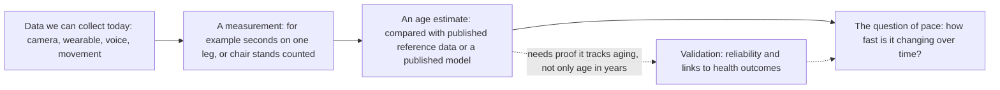

## ELI5: the whole hack in one paragraph

Think of a used car. The odometer tells you how many miles it has driven, and that is like your age in years. But two cars with the same mileage can be in very different shape, and one can be wearing out faster than the other. Scientists look for "biomarkers of aging", which are measurements that act like a mechanic's checks: they try to tell how worn the engine really is, and how fast it is wearing, not just what the odometer says. Sundai Hack 143 asked teams to build, in one day, a small web app that does this kind of check using things we can collect today, like a phone camera [F51] [F52]. We chose to have the camera watch a person do a one-leg stand and a few chair stands, then compare the result with tables that researchers published for people of different ages, the way a test drive is compared with a table of results from many cars of each age. The app shows where the result falls and which study the table came from. It does not tell anyone their health, and it is not a medical device.

## The big picture

The field moves in four steps, and our app only covers the first three, in a small way. The last step, pace, needs repeated measurements over time, which a one-day demo cannot give [F41].

The dotted path matters most. A model that only guesses age in years is not enough. The field asks whether a measure is reliable when repeated and whether it is linked to outcomes such as illness and death [F42] [F46].

## Map of this repo

| Path | What it is |
|---|---|
| `index.html` and `src/` | The demo: the web app a voter opens on a phone or laptop. |
| `public/explainer/` | The picture explainer: a visual walk through the same story. |
| `research/` | The evidence trail: `findings.json` (what the research agents found), `quotecheck.json` (a script checking each quote against its source), `verified.json` (the findings that survived review, which every `[F##]` citation points to) and `synthesis.json` (scored ideas, the pick and the pitch). |
| `scripts/` | The tooling: `quotecheck.py`, `resolve-sources.py`, `merge-verified.py`, `render-sources.py`, `build-readme.mjs` (builds this README from `docs/star/`) and `wrap-explainer.mjs`. |
| `tests/` | `unit/` for fast logic and docs checks, `e2e/` for browser tests. |
| `.github/workflows/ci.yml` | CI/CD: tests on every push, deploy to GitHub Pages only from `main` after the tests pass, then a smoke test on the live URL. |
