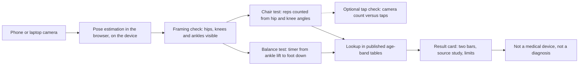

## T and A: Task and Action

### Task

We set out to build and publish, within one Sunday, a working web app that speaks to the hack's question: how fast is someone aging, using data we can collect today. The app had to be live on a public URL by the 20:00 presentations [F51].

Our constraints:

- One day, with team formation at 11:00 and presentations at 20:00 [F51]. Anything that needed training a model or a server was out.
- A voter should be able to try it on their own device in about 60 seconds.
- Every number on screen must come from a published source, shown next to the number.
- The app estimates an age band from published reference data or a published model. It must never claim to diagnose, to measure health or to replace a clinician. Not a medical device.
- Open source, public URL, and a team of at least two (these rules are unconfirmed by any finding, see the Situation).
- Do not copy what the crowd is likely to build, and credit prior art openly.

### The candidate approaches

Before choosing, we had research agents survey five lanes (imaging, movement and fitness, wearables and voice, aging-clock science, and the hack itself). Each finding was then checked by script and by reviewers. Where a source did not hold up, we dropped it, and where it held up only in part we mark it "unverified" or state its limits. Below, each approach lists what it reads, how it estimates aging, the evidence, what a one-day build would take and whether a voter could try it in 60 seconds.

#### FaceAge (face photo)

- **Reads:** a face photo.
- **How it estimates aging:** a deep-learning system estimates a biological age from the face. The public code uses MTCNN face localization plus an Inception-ResNet v1 age estimator [F14]. It was developed at Mass General Brigham, led by Hugo Aerts, and trained on 58,851 photos of presumed healthy people from public datasets [F12].
- **Evidence:** cancer patients looked about 4.79 years older than a non-cancerous reference cohort [F11]. In 6,196 cancer patients from two centers, older FaceAge was associated with worse survival, especially in people who looked older than 85 [F13]. This is evidence in cancer patients. It is not validation in healthy adults. The repository states its code and data are not intended for clinical care or commercial use, and no license type was seen on the page [F14]. We could not confirm a current permanent link to the model weights.
- **One-day build:** medium risk at best. Without the original weights we would need a substitute model, and a substitute does not carry FaceAge's evidence. Each team that builds this has the same problem.
- **60 seconds:** yes, a selfie is the fastest demo of all. It is also the most likely to be built by other teams, because it is the first example in the brief.

#### HandAge (hand photo)

- **Reads:** a photo of the back of the hand.
- **How it estimates aging:** the only hand-photo work we found predicted chronological age, not biological age. We state none of its error figures: the one claim we extracted from a news page had its numbers swapped on review, and we removed it.
- **Evidence:** thin. Not established: any HandAge-named model, public code or model weights, or any link between hand photos and illness or death. One point survived: hand images can identify a person, as faces can, which is a privacy risk [F16].
- **One-day build:** not realistic, since no weights were found.
- **60 seconds:** a photo is quick, but we would be showing a number with no evidence behind it.

#### Wearable-based aging biomarkers

- **Reads:** exports from a wrist device, such as resting heart rate, heart-rate variability, sleep and steps.
- **How it estimates aging:** a composite over time. We explored the idea of a pace score from two time windows, borrowing the rate-not-level idea from DunedinPACE [F41].
- **Evidence:** thin for wearables as such. Heart-signal evidence is covered under cardiovascular below. The validation template (reliability plus outcome association) is clear [F42], but we found no evidence that a wearable composite tracks aging.
- **One-day build:** medium to hard. Parsing exports is easy, but a defensible composite is not.
- **60 seconds:** no. A voter would have to export personal health data on stage.

#### Voice

- **Reads:** a short speech recording.
- **How it estimates aging:** the open audeering model, wav2vec2-large-robust-24-ft-age-gender, outputs age on a 0 to 1 scale (0 to 100 years) plus child, female and male probabilities. Its license is CC-BY-NC-SA-4.0 (non-commercial), and an ONNX export is on Zenodo [F33].
- **Evidence:** the paper behind it reports age error between 7.1 and 10.8 years depending on dataset. It predicts chronological age only, not biological age [F34]. We found no evidence tying voice to biological aging or frailty.
- **One-day build:** hard to do on a phone browser. A large model in the browser or a hosted endpoint would be needed.
- **60 seconds:** yes, speaking for ten seconds works. But the output would be a guess of years with a large error, not a biomarker.

#### Movement (balance and chair stands)

- **Reads:** camera video of a person standing on one leg and rising from a chair, with pose estimation in the browser.
- **How it estimates aging:** timing and rep counts are placed on published age-band reference tables.
- **Evidence:**
  - Unipedal stance norms for 549 healthy adults aged 18 and over, with six age bands from 18 to 39 up to 80 and over, for eyes open and closed [F22]. The abstract gives no per-band seconds.
  - Sit-to-stand percentiles by sex and age (5-rep, 30-second and 1-minute tests) in 393 healthy Colombian adults [F23]. The abstract gives no percentile tables.
  - Inability to complete a 10-second one-leg stance was associated with all-cause mortality after adjusting for age, sex, BMI and comorbidities, hazard ratio 1.84 (95% CI 1.23 to 2.78), in 1702 adults aged 51 to 75 [F21] (unverified: the script quote check failed, though reviewers upheld it from the Europe PMC abstract). It must not be applied to people under 51.
  - Remote video sit-to-stand assessment showed good to moderate validity against in-person testing in 38 post-COVID adults, with minimal detectable change values of 6.6 and 10.5 repetitions [F24]. Human raters did that rating, not pose estimation.
  - Thin spots: we found no study validating pose estimation for rep counting or balance timing. We did not retrieve chair height and arm position protocols.
- **One-day build:** realistic. It is a static site with no server and no training. The risk is transcribing reference tables from full texts and getting the camera framing right.
- **60 seconds:** yes, with the whole body in view, so a friend holds the phone or it is propped up.

#### Sleep

- **Reads:** a sleep export or a sleep CSV.
- **How it estimates aging:** a sleep regularity score computed in the browser.
- **Evidence (unverified, and restricted):** in a UK Biobank accelerometer cohort, higher sleep regularity was associated with lower all-cause mortality [F31] (unverified). Regularity was a stronger mortality predictor than duration [F32] (unverified). Review restricted both: the cohort averages 62.8 years and the regularity score came from seven days of wrist accelerometer data. We do not apply those mortality figures to adults aged 20 to 70, and we do not use the numeric range from [F31] here. The score formula and quintile cutoffs were not retrieved.
- **One-day build:** medium. Parsing is simple.
- **60 seconds:** no. It needs health data exported on stage.

#### Cardiovascular signals

- **Reads:** pulse from the phone camera, by fingertip or from the face.
- **How it estimates aging:** a heart rate or a pulse-wave model.
- **Evidence:** in healthy young adults, fingertip camera heart rate matched resting ECG (r=.997, RMSE 1.03 beats per minute). Contact-free face pulse was less accurate than fingertip, especially after exercise [F35]. A deep-learning "PPG age" exists as a preprint from a Peking University group, using 212,231 UK Biobank participants with a check in MIMIC-III (2,343) [F36]. We could not retrieve weights for it. We found no evidence that heart rate from a phone camera tracks aging. A consumer app already estimates body age from fingertip pulse plus an activity questionnaire [F56].
- **One-day build:** medium to hard. Face pulse is fragile in hall lighting.
- **60 seconds:** yes for a fingertip heart rate, but it is a heart rate, not an aging measure.

#### Fitness

- **Reads:** a set of fitness tests (chair stand, grip, walking, step test).
- **How it estimates aging:** a regression equation turns test results into a "fitness age". A Korean cohort of 501,774 people built such equations. The older-adult model uses the 30-second chair stand, grip, 2-minute step, sit-and-reach, timed up and go and sex (adjusted R2 24.3%), and the adult model reached 93.6% [F25]. It is based on supervised fitness-centre data.
- **Evidence:** a Chinese cohort of 2207 adults aged 60 and over derived a physical fitness age from a 5-time chair stand plus grip, walking speed and peak flow. Accelerated aging on that measure had adjusted odds ratios of 1.88 for depressive symptoms and 1.76 for cognitive impairment, in a cross-sectional design [F26]. Grip and peak flow need equipment, which a camera app lacks. This does not apply below 60.
- **One-day build:** only the chair-stand part is camera friendly. We kept the Korean equation as a stretch goal, if its coefficients can be read from the full text.
- **60 seconds:** only the chair stand.

#### Combinations

We looked at four ways to fuse signals:

- A three-signal panel: face-video heart rate, a heart-rate-variability proxy and a voice age estimate. The most vivid AI on stage, and the weakest science. The voice error is [F34] and face pulse is less accurate than fingertip [F35].
- An "arcade" combining face photo, 30-second sit-to-stand and fingertip pulse into one age. No published method in our findings combines these signals into one age, and three captures will not fit in 60 seconds.
- Face estimate beside the movement bands. The movement half carries the evidence [F22] [F23], and the face half would need a licensed model while FaceAge is research-only [F14].
- Movement plus fingertip pulse before and after chair stands, with separate bars. Showing domains separately follows the per-organ argument in proteomic aging [F45], which is an analogy and not evidence for these signals.

Evidence overall: thin. Combination makes for good theatre, but we found nothing that validates a fused age.

### How we scored them

We scored each idea from 0 to 5 on five criteria, with these weights: live demo 25, science 25, differentiation 15, buildability 20, AI and wow 15. Totals below are computed in code from those weights and are out of 100. They are exactly as in `research/synthesis.json`.

| Rank | Idea (ref) | Live demo | Science | Differentiation | Buildability | AI and wow | Total |
|---|---|---|---|---|---|---|---|
| 1 | Movement Age (PRIOR) | 4 | 4 | 3 | 4 | 4 | 77 |
| 2 | Chair-Rise Age, merged with I51 (I21) | 4 | 3 | 2 | 5 | 4 | 73 |
| 3 | Count vs Tap (I22) | 4 | 2 | 4 | 5 | 3 | 71 |
| 4 | Look Age vs Move Age (NEW-1) | 4 | 3 | 3 | 2 | 5 | 67 |
| 5 | AgeGap Selfie Lab (I11) | 5 | 2 | 1 | 3 | 4 | 62 |
| 6 | Age-Gap Evidence Board (I12) | 3 | 3 | 3 | 5 | 1 | 62 |
| 7 | Three-Signal Aging Panel (I32) | 4 | 1 | 3 | 2 | 5 | 57 |
| 8 | Aging Clock Arcade (I52) | 3 | 2 | 3 | 2 | 5 | 57 |
| 9 | Pulse plus Pose (NEW-2) | 3 | 2 | 2 | 3 | 4 | 55 |
| 10 | Clock Report Card (I41) | 1 | 3 | 4 | 3 | 1 | 47 |
| 11 | Regularity Check (I31) | 2 | 2 | 3 | 3 | 1 | 44 |
| 12 | Pace Not Age (I42) | 1 | 2 | 4 | 2 | 2 | 41 |

Three notes on the table. First, the selfie idea has the best live demo and the lowest differentiation, which is the trade we expected. Second, Count vs Tap is a validity check, not an aging measure, so we used it as a feature of the winner rather than a product. Third, Clock Report Card and Pace Not Age score high on differentiation but voters cannot try them on themselves, so they score 1 on live demo.

### Why we chose Movement Age

The pick is Movement Age: prop up your phone, do a one-leg stand and five chair stands, and on-device pose estimation places each result on a published age-band reference table, with the source shown and nothing leaving the device.

Why:

- Every voter can test themselves in the room, and the result rests on published reference values that span adult ages for both tests [F22] [F23].
- It is the only phone-friendly test in our findings with a mortality association after adjusting for age, sex, BMI and comorbidities [F21] (unverified). It is narrow (adults aged 51 to 75), so we show it as context and never as a prediction about the user.
- Remote video assessment of sit-to-stand already showed good to moderate validity against in-person testing [F24]. Adding a live tap check, where a friend taps for each rep and the app shows camera count against tap count, turns that into a visible measured error. That fits the reliability-first template this audience uses [F42] [F46].
- It fits a day's build: a static site, pose estimation on the device, no server and no training [F51].
- It stays out of the crowd most likely to build selfie age, and out of FaceAge's research-only terms [F14]. Hand-age evidence did not survive review.

Honest limits, which we show in the app:

- The age-band numbers are not in the abstracts of [F22] or [F23]. They have to be read from the full texts and transcribed. If we cannot open the full texts, the fallback is to show raw time and reps with the study bands described, and no placement.
- The youngest band in [F22] covers 18 to 39, so we show an age band and never an exact year.
- [F23] is a Colombian sample tested under supervision, [F22] dates from 2007, and chair height may shift results.
- A one-leg stand can cause a fall, so the app tells users to stand next to a wall or chair back.

Kill criteria we set before choosing, and their status as of the synthesis:

| ID | Criterion | Status |
|---|---|---|
| K1 | A published reference table for the chosen tests covers adults from roughly 20 to 80. | Pass on coverage [F22] [F23]. The per-band numbers are not yet in hand. |
| K2 | Evidence that the measure predicts mortality or morbidity beyond chronological age. | Narrow pass: [F21] (unverified), adults aged 51 to 75 only. For chair stands the only outcome link is a composite fitness age in adults aged 60 and over [F26]. Nothing in our findings covers ages 20 to 50. |
| K3 | The 10:30 intro does not hand out data, a model or a prize that favours another modality. | Pending, to be judged live at 10:30 [F51]. |
| K4 | No teammate brings a better idea at 11:00. | Pending, to be judged at team formation. |

How it differs from the existing app. A camera sit-to-stand app already exists: Sit To Stand App on iOS scores the chair-rise test from 240 frames-per-second video and reports time, velocity and muscle power [F55]. Its "scientifically validated" label is the developer's own claim, not independent evidence, and it is Apple-only. We name it as prior art and do not compete with it on biomechanics. What differs: ours runs in any phone or laptop browser with no install, combines a balance test with the chair test, and places each result on published age-band tables, with the source study and cohort shown for each number. The F55 listing does not describe an age-referenced readout. We also differ from the existing phone body-age app that uses fingertip pulse plus a questionnaire [F56]: we show our sources and our measured counting error, not a single body-age score.

### Build plan

Nothing is uploaded. The reference tables ship inside the page, and each bar on the result card names the study and cohort it came from.

CI/CD: every push to the repository runs typecheck, unit tests, a production build and browser tests (Playwright, Chromium). Only the `main` branch deploys to GitHub Pages, and only after those tests pass, so a red test can never reach the live site. After the deploy, a smoke test runs the browser tests against the live URL. Pull requests run the same checks but never deploy. The docs, including this file, are checked in CI too: no em or en dashes, and every `[F##]` citation must point at a finding that survived verification.
